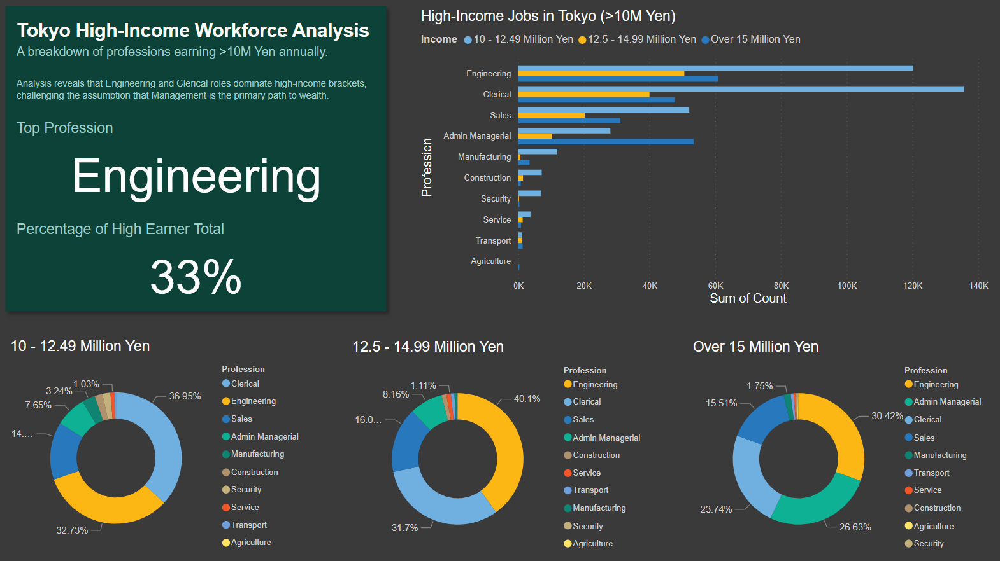

# Project 2: Japan Socio-Economic Atlas (Tokyo Pilot)

## 1. Project Objective
The goal of this project was to build a relational database from raw, unstructured government data to analyze the relationship between **Occupation** and **High Income** in Japan. The pilot phase focused specifically on the high-income workforce (>10 Million Yen) in **Tokyo**.

## 2. Core Tools & Skills
* **Python (Pandas):** Used to write custom cleaning scripts to strip complex headers from government Excel files and normalize column names.
* **SQL (SQLite):** Used to build a relational database (`japan_atlas.db`) and execute targeted queries to filter for specific regions (Tokyo) and income brackets.
* **Power BI:** Used for data modeling (unpivoting), DAX measure creation, and designing the final Executive Dashboard.

## 3. The Process (ETL & Analysis)
1.  **Data Extraction:** Acquired raw "Employment Status Survey" data (Tables 4 and 25) containing multi-layered headers.
2.  **Python Cleaning:** Wrote a custom Python script (`clean_data.py`) to:
    * Automatically detect and strip metadata rows.
    * Split the "Area" column into separate `Prefecture Code` and `Prefecture Name` columns for SQL indexing.
    * Standardize column names for database ingestion.
3.  **Database Construction:** Built a SQLite database and loaded the clean data into two linked tables: `labor_force` and `income_occupation`.
4.  **SQL Analysis:** Executed a complex SQL query to filter for **"Tokyo-to"** and **Income brackets > 10 Million Yen**, exporting the results to a clean CSV for visualization.
5.  **Visualization:** Built an interactive Power BI dashboard, utilizing **DAX measures** to calculate percentage shares and **Unpivoting** techniques to restructure the data for visual comparison.

## 4. Key Findings (The Story)
* **Finding 1: The Professional Dominance.** Contrary to the assumption that executive management is the primary path to wealth, **Clerical** roles are actually the #1 high-income profession in Tokyo, followed closely by **Professional/Engineering**.
* **Finding 2: The Technical Premium.** Technical expertise is highly valued in the capital; **Engineering roles alone account for 39.06%** of the high-income workforce analyzed.
* **Finding 3: Income Distribution.** The wealth pyramid is visible: **44.09%** of high earners fall into the entry high-income bracket (10-12.5M Yen), while only **16.85%** reach the top tier (>15M Yen).

## 5. Visualizations
Below is the Executive Dashboard analyzing the high-income workforce in Tokyo (Total High Earner Count: 308K).

## 6. Future Scope
The next phase of this project will expand the SQL analysis from the Tokyo Pilot to a **National Atlas**, using the full dataset to compare income inequality and professional distribution across all 47 prefectures.
